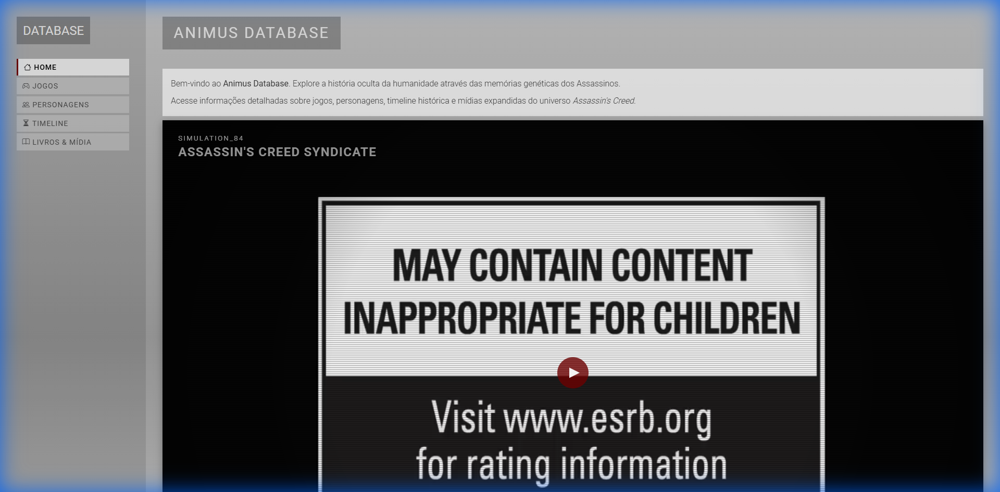
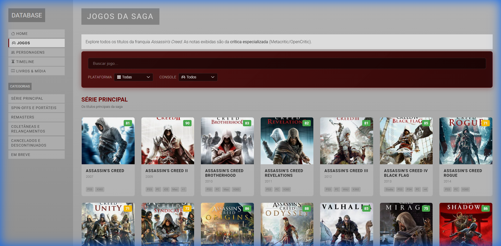
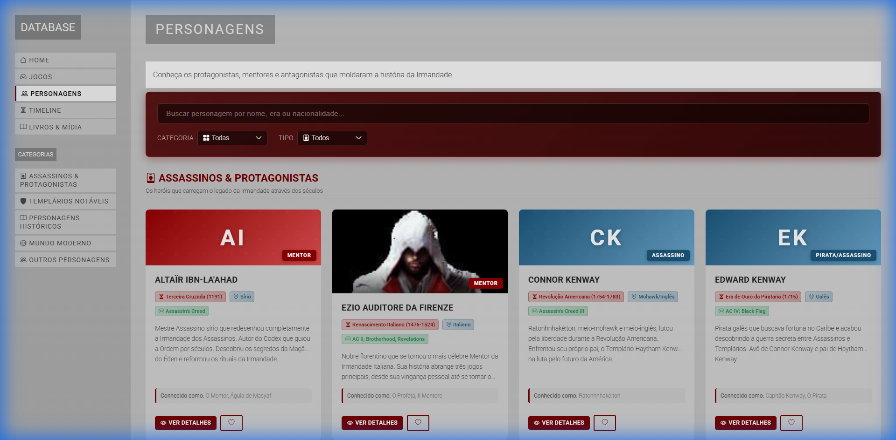
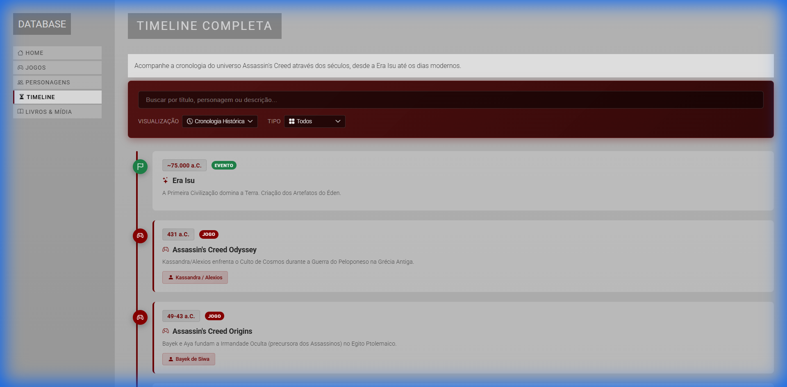
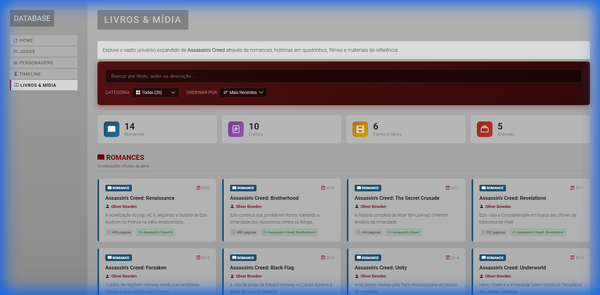

# 🗡️ Assassin's Creed Database

<div align="center">


**Um database temático estilo Animus para explorar o universo de Assassin's Creed**

[🎮 Ver Demo](#) • [📖 Documentação](#-estrutura-do-projeto) • [🐛 Reportar Bug](../../issues)

</div>

---

## 📸 Screenshots

<div align="center">

### 🏠 Home - Animus Player
Interface imersiva com player de vídeo estilo Animus e cards de navegação.



---

### 🎮 Jogos
Catálogo completo com dados da IGDB API, filtros e categorização.



---

### 👤 Personagens
Galeria de personagens com imagens da API e dados curados manualmente.



---

### � Timeline
Cronologia histórica e ordem de lançamento interativa.



---

### 📚 Livros & Mídia
Romances, comics, filmes e artbooks da franquia.



</div>

---

## ✨ Funcionalidades

- 🎬 **Player de Vídeo Animus** - Interface imersiva com efeitos de scanlines e glitch
- 🎮 **Catálogo de Jogos** - Integração com IGDB API para dados em tempo real
- 👤 **Personagens** - Abordagem híbrida: imagens da API + descrições em português
- 📅 **Timeline Interativa** - Cronologia histórica e por lançamento
- 📚 **Livros & Mídia** - Romances, comics, filmes e artbooks
- 🔍 **Busca e Filtros** - Pesquisa em todas as seções
- 💾 **Cache Inteligente** - Respostas da API armazenadas por 1 hora
- 📱 **Design Responsivo** - Funciona em desktop e mobile

---

## 🛠️ Tecnologias

| Categoria | Tecnologias |
|-----------|-------------|
| **Backend** | PHP 8.0+, MVC Light Architecture, Composer |
| **Frontend** | HTML5, CSS3 (Custom), JavaScript Vanilla |
| **API** | IGDB (Internet Game Database) via Twitch Auth |
| **Ícones** | Bootstrap Icons |
| **Vídeo** | HTML5 Video Player + YouTube API |

---

## 📁 Estrutura do Projeto

```
Assassins_Creed/
├── app/
│   ├── Controllers/       # Controladores MVC
│   │   ├── GamesController.php
│   │   ├── CharactersController.php
│   │   ├── TimelineController.php
│   │   └── MediaController.php
│   ├── Models/            # Modelos e lógica de negócio
│   │   ├── ApiClient.php  # Cliente IGDB com cache
│   │   ├── Game.php
│   │   ├── Character.php
│   │   └── Media.php
│   ├── Views/             # Templates PHP
│   │   ├── home/
│   │   ├── games/
│   │   ├── characters/
│   │   ├── timeline/
│   │   └── layouts/
│   ├── Core/              # Framework core
│   │   ├── App.php
│   │   ├── Controller.php
│   │   └── Router.php
│   └── Data/              # Dados JSON + Cache
│       ├── characters.json
│       ├── timeline.json
│       ├── media.json
│       └── cache/
├── public/                # Arquivos públicos
│   ├── index.php          # Entry point
│   ├── CSS/style.css
│   └── JS/main.js
├── config/
│   └── app.php            # Configurações
├── Videos/                # Vídeos locais
├── .env                   # Credenciais (não versionado)
├── composer.json
└── README.md
```

---

## 🚀 Instalação

### Pré-requisitos

- PHP 8.0 ou superior
- Composer
- Servidor web (Apache/Nginx) ou XAMPP
- Credenciais IGDB (Client ID e Access Token)

### Passo a Passo

1. **Clone o repositório**
```bash
git clone https://github.com/AndersonC96/Assassins_Creed.git
cd Assassins_Creed
```

2. **Instale as dependências**
```bash
composer install
```

3. **Configure o ambiente**
```bash
cp .env.example .env
```

4. **Edite o arquivo `.env`**
```env
IGDB_CLIENT_ID=seu_client_id
IGDB_ACCESS_TOKEN=seu_access_token
APP_URL=http://localhost/Assassins_Creed/public
```

5. **Obtenha credenciais IGDB**
   - Acesse [Twitch Developers](https://dev.twitch.tv/console)
   - Crie uma aplicação
   - Gere o Client ID e Access Token
   - Consulte a [documentação IGDB](https://api-docs.igdb.com/)

6. **Inicie o servidor**
```bash
# Usando PHP built-in server
php -S localhost:8000 -t public

# Ou configure no Apache/XAMPP
```

---

## 🔧 Configuração da API IGDB

O projeto usa a API IGDB para buscar dados de jogos. O arquivo `ApiClient.php` gerencia:

- **Autenticação** via Client ID e Bearer Token
- **Cache** de respostas por 1 hora (3600 segundos)
- **Endpoints**: `/games`, `/characters`, `/covers`, `/screenshots`

### Exemplo de Query
```php
$api = new ApiClient();
$games = $api->getGamesByIds([127, 113, 537]); // AC II, Brotherhood, Revelations
```

---

## 📊 Dados Locais

Alguns dados são mantidos localmente em JSON para:
- Descrições em português
- Categorização customizada
- Personagens com dados curados

| Arquivo | Conteúdo |
|---------|----------|
| `characters.json` | 50+ personagens com bio em PT-BR |
| `timeline.json` | 60+ eventos históricos e lançamentos |
| `media.json` | 30+ livros, comics e filmes |

---

## 🎨 Design System

O projeto usa um sistema de design dark theme com cores inspiradas no Animus:

```css
:root {
    --bg-dark: #1a1a1a;
    --accent-red: #8B0000;
    --text-primary: #f5f5f5;
    --item-bg: #fafafa;
}
```

### Componentes Reutilizáveis
- `.search-filters-container` - Barra de busca e filtros
- `.custom-select-wrapper` - Dropdowns estilizados
- `.card` - Cards de jogos/personagens
- `.category-header` - Headers de seção

---

## 📝 Licença

Este projeto é apenas para fins educacionais e de portfólio.

**Assassin's Creed** e todos os assets relacionados são propriedade da **Ubisoft**.

Dados de jogos fornecidos por [IGDB.com](https://www.igdb.com/).

---

## 👨‍💻 Autor

**Anderson Cavalcante**

[](https://www.linkedin.com/in/andersoncavalcante96/)
[](https://github.com/AndersonC96)

---

<div align="center">

**"Nothing is true, everything is permitted."**

</div>
